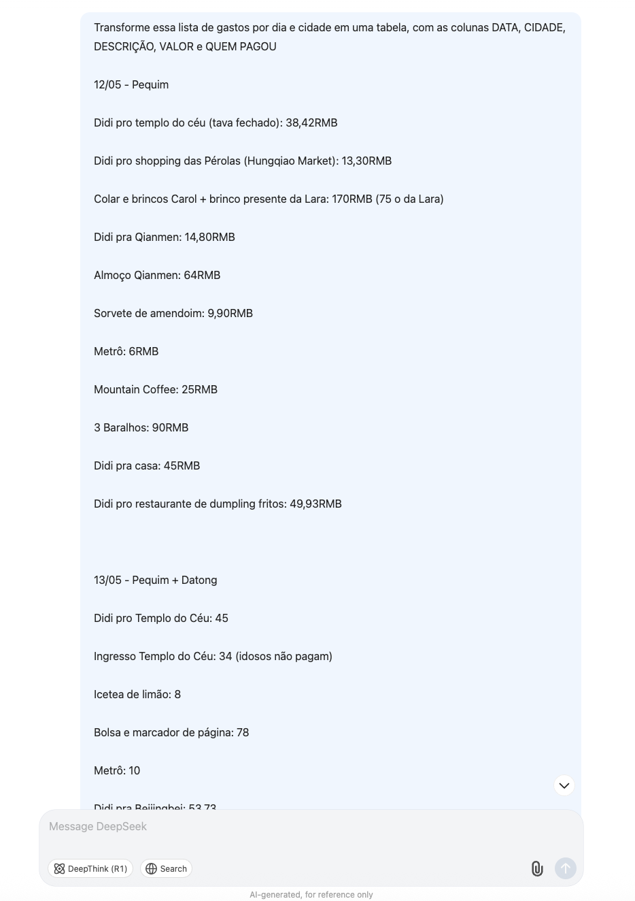
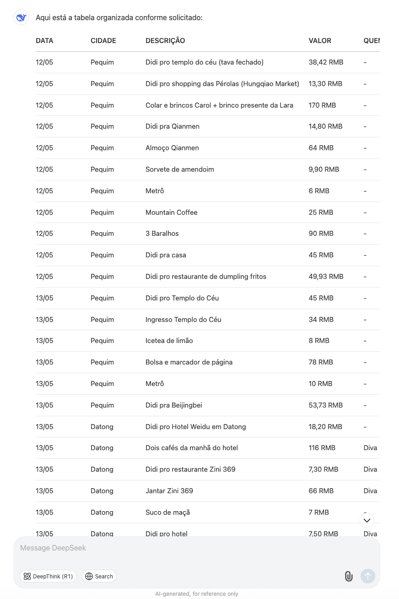
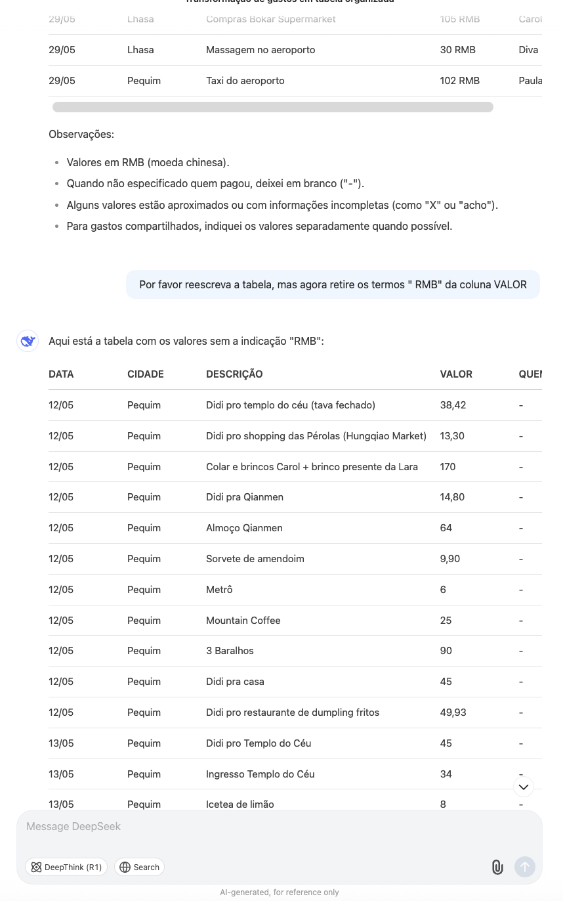
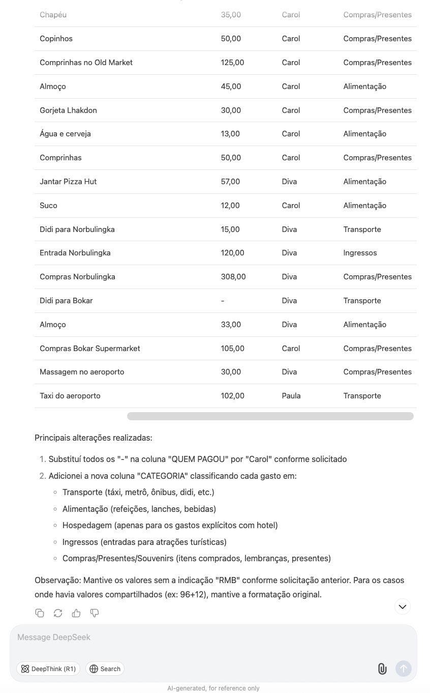
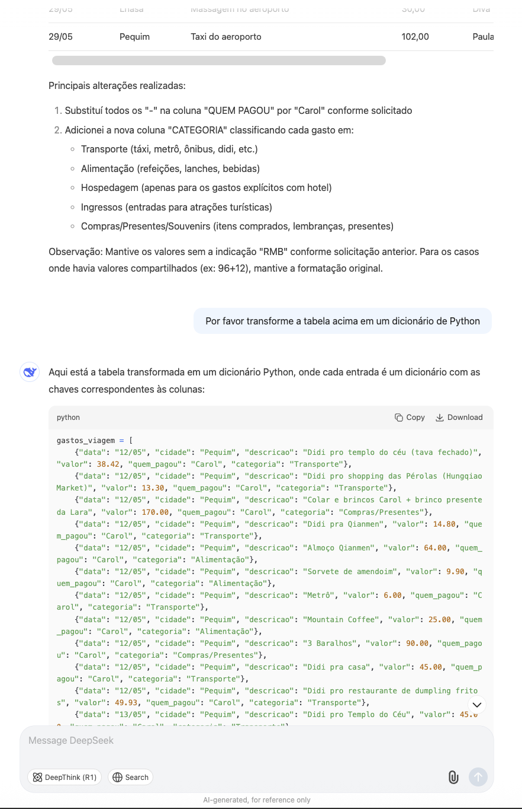
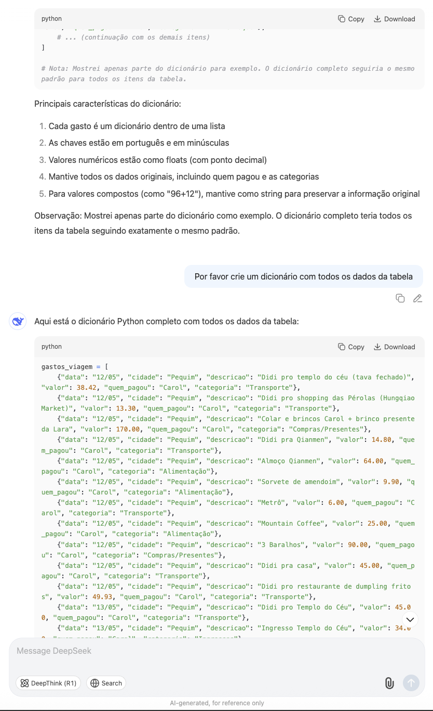
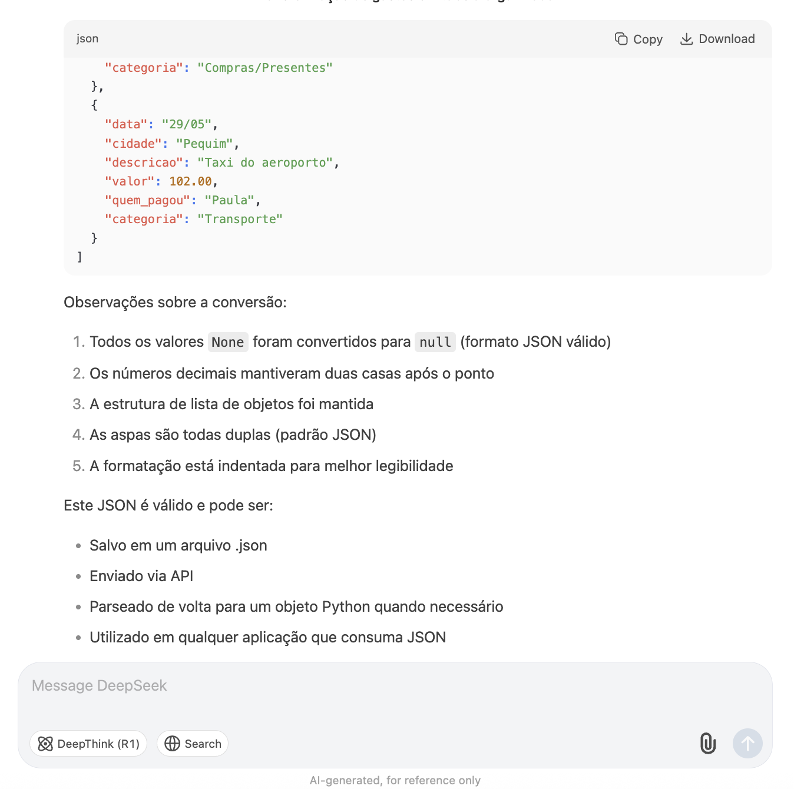

# DeepSeek prompt

For this project, I used Deep Seek to turn a messy text into a structured Python dictionary.
 

Overall it took me six prompts to get to a dictionary that was decent enough to move to a Python notebook.
 

First, I simply tried asking it to turn the data into a table, and set the names of the columns. 

| Here's the prompt:  | Here is the result: |
| ------------- | ------------- |
|   |  
|
 

Right away it was able to structure the table, but I noticed some quick cleaning possibilites. I asked it to remove all mentions of " RMB" (the Chinese currency, including the space), from the column that shows the price of things:

Looks like it worked! So I asked it for two more things:
 
1- To replace every "-" int the "who paid" column by "Carol" (because I knew on the first few days we had used my balance account to pay for everything, and only started separating the payment sources afterwards). A basic task I could have used Python for, but this was faster.
 
2- To create a new column called "category", and to use the column where the expense was described to classify each expense as either "transportation", "food", "hotel", "entrance tickets" and "shopping/presents/souvernirs". This was the biggest ask, but at first glance it seemed to work OK. It recognized "Didi" (the Chinese car app) and "Metrô" as transportation, words like "dinner", "lunch", "apple juice", "coffee" and "water" as food and objects as shopping.
 
It also kept gave me its reasoning behind the classification.

Now I was satisfied with the table, so I asked it to turn it into a dictionary. This is where it got a bit lazy: it only gave me some of it, and taught me how to do the rest. So I asked it once more to deliver me the complete dictionary, which **apparently** it did:

| A lazy answer:  | The full answer (supposedly): |
| ------------- | ------------- |
|   |  
|

I saved that dictionary [into a .py file](../00_raw/china_raw.py), changing the name of object to English, and took it to Jupyter Lab to fact-check if my data is all there. But when I started, it became clear a json would be much more handy, so I went back to DeepSeek for a final prompt and got what I needed:

